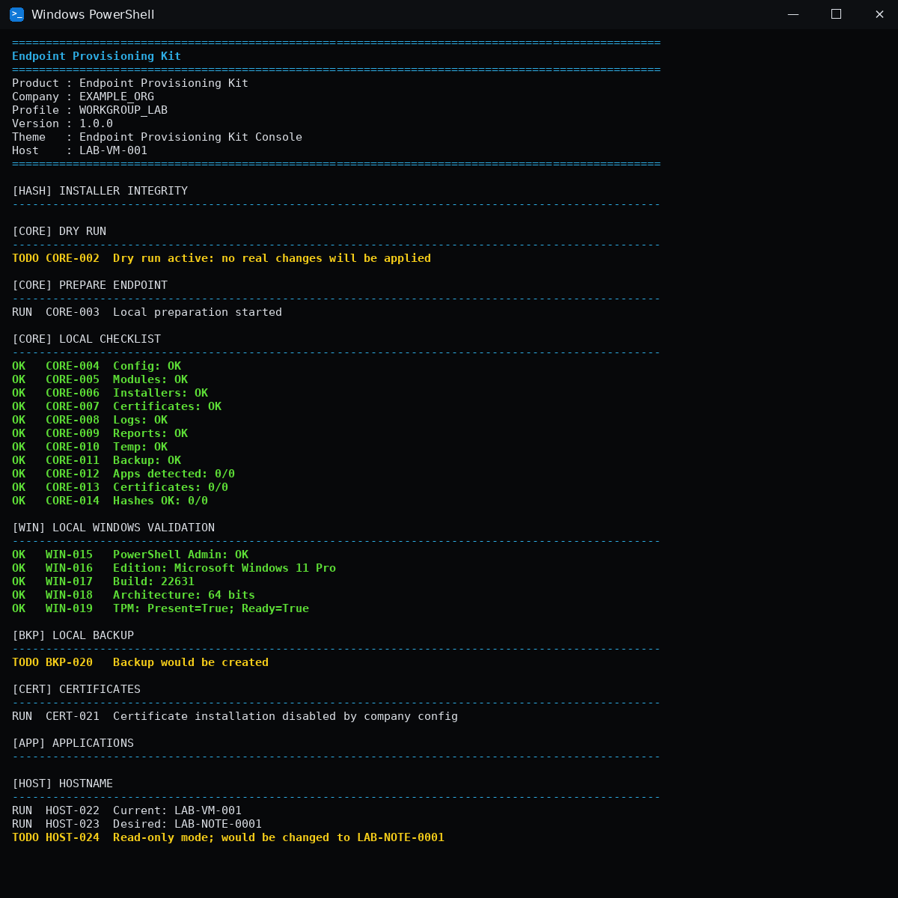
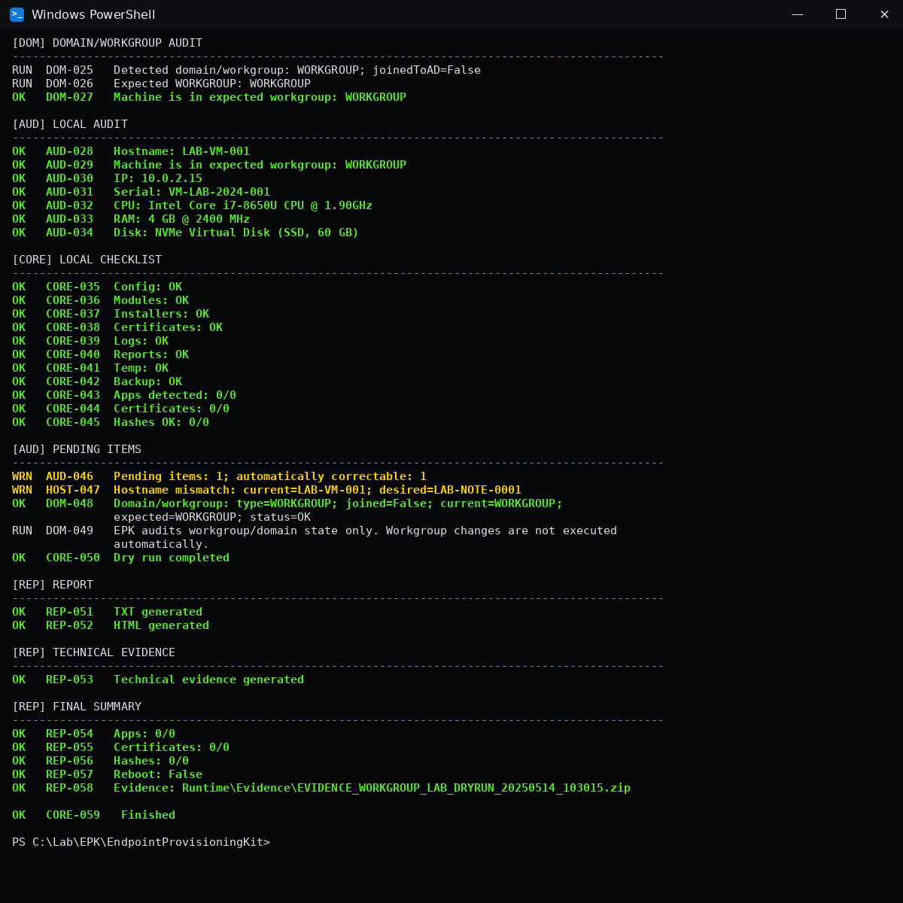

# Endpoint Provisioning Kit

**Version 1.0.0**

Endpoint Provisioning Kit (EPK) is a modular PowerShell template for preparing, validating and auditing Windows endpoints.

The public repository is intentionally environment-neutral. It runs in **WORKGROUP/local mode by default**, installs no applications, installs no certificates and does not require Active Directory to validate or test the project.

> The screenshots and sample reports below use simulated lab data only. No production domain, credential, certificate, installer or organization-specific value is included.

## Demo

### Dry run — part 1



### Dry run — part 2



Sample reports generated in the same format used by the project:

- [TXT report](docs/reports/WORKGROUP_LAB_DRYRUN_20250514_103015.txt)
- [HTML report](docs/reports/WORKGROUP_LAB_DRYRUN_20250514_103015.html)

## What it does

- validates the local Windows environment;
- inventories hostname, IP, serial, CPU, RAM and disk;
- validates workgroup/domain state;
- generates a desired hostname from a configurable pattern;
- detects configured applications;
- validates installer SHA-256 hashes;
- optionally installs applications and certificates;
- creates backups before operational changes;
- generates TXT, HTML, logs and technical-evidence packages;
- supports validation, audit and dry-run flows before any mutation;
- supports optional Active Directory integration behind explicit opt-in gates.

## Safe by default

| Capability | Public default |
|---|---|
| Active Directory | Disabled |
| Domain join | Disabled |
| Application installation | Disabled |
| Certificate installation | Disabled |
| Automatic reboot | Disabled |
| Installer binaries | Not included |
| Real certificates | Not included |
| Credentials/secrets | Not included |

A domain join requires both the configuration to explicitly enable it **and** the runtime switch `-AllowDomainJoin`.

## Requirements

- Windows PowerShell 5.1;
- Windows 10/11 or a compatible Windows Server version;
- Administrator privileges for operational execution.

Active Directory, private DNS, installers and certificates are optional integrations, not requirements for the template itself.

## Quick start

Run the static checks:

```powershell
Set-ExecutionPolicy -Scope Process Bypass
.\Tests\Invoke-EndpointProvisioningStaticTests.ps1
```

Validate the public profile:

```powershell
.\EndpointProvisioning.ps1 -Mode VALIDATE
```

Simulate a complete run without changing Windows:

```powershell
.\EndpointProvisioning.ps1 -Mode DRYRUN -MachineType NOTE -Sector IT -Asset 0042
```

Run an audit:

```powershell
.\EndpointProvisioning.ps1 -Mode AUDIT
```

## Adapt it to your environment

Do **not** hard-code your company values inside the modules. Create a local configuration file instead:

```powershell
Copy-Item .\Config\company.json .\Config\company.local.json
```

`Config/company.local.json` is ignored by Git.

Run your local profile with:

```powershell
.\EndpointProvisioning.ps1 -Mode VALIDATE -Config .\Config\company.local.json
```

### Where to change what

| File / folder | Change here when you need to... |
|---|---|
| `Config/company.local.json` | Set company name, hostname prefix/pattern, departments, workgroup/domain, network metadata, enabled apps, certificates and report behavior. |
| `Config/Examples/workgroup.example.json` | Start from a simple workgroup-only environment. |
| `Config/Examples/active-directory.example.json` | Start from an AD-enabled environment. The example ships disabled and uses `example.invalid`. |
| `Config/apps.json` | Add or change application definitions, installer paths, silent arguments and detection rules. |
| `Config/hashes.json` | Store approved installer hashes. Prefer generating this through `UPDATEHASHES`. |
| `Config/settings.json` | Change engine/runtime defaults that are not company-specific. |
| `Config/ui.json` / `Config/menu.json` | Adjust console/menu behavior. |
| `Assets/theme.json` | Adjust display labels and console colors. |
| `Installers/` | Place approved local installer payloads. Binaries are ignored by Git. |
| `Certificates/` | Place local certificate files. Certificate/private-key payloads are ignored by Git. |
| `Modules/` | Extend engine behavior only when configuration is not enough. |

For most environments, **`Config/company.local.json` + `Config/apps.json` are the only files you should need to edit first**.

## Company profile

The public `Config/company.json` is only a runnable baseline:

```json
{
  "Company": {
    "Name": "EXAMPLE_ORG",
    "HostnamePrefix": "LAB",
    "DefaultDepartment": "IT"
  },
  "Domain": {
    "Enabled": false,
    "Workgroup": "WORKGROUP",
    "Join": {
      "Enabled": false
    }
  }
}
```

Keep the committed profile generic. Put environment-specific values in `company.local.json` or another ignored local profile.

## Hostname pattern

Default pattern:

```text
{PREFIX}-{TYPE}-{ASSET}
```

Supported tokens include:

```text
{PREFIX} {TYPE} {ASSET} {SERIAL} {SECTOR} {DEPARTMENT} {COMPANY} {PROFILE}
```

Keep generated names at or below 15 characters when compatibility with legacy Windows/NetBIOS tooling matters.

## Applications

Application metadata lives in `Config/apps.json`. Example:

```json
{
  "Id": "7zip",
  "Name": "7-Zip",
  "Installer": "Compression/7z-x64.exe",
  "Type": "EXE",
  "Arguments": "/S"
}
```

To enable selected applications in your local company profile:

```json
"Apps": {
  "InstallDefaultApps": true,
  "Catalog": "Config/apps.json",
  "Include": ["chrome", "7zip"],
  "Exclude": []
}
```

Create the referenced subfolder under `Installers/`, add the approved installer and update the hash catalog:

```powershell
.\EndpointProvisioning.ps1 -Mode UPDATEHASHES -Config .\Config\company.local.json
```

Validate hashes before an operational run:

```powershell
.\EndpointProvisioning.ps1 -Mode HASHES -Config .\Config\company.local.json
```

## Active Directory

AD is optional. Start from:

```text
Config/Examples/active-directory.example.json
```

The example ships with both `Domain.Enabled` and `Domain.Join.Enabled` set to `false` and uses the reserved `.invalid` namespace.

A real join additionally requires explicit authorization at runtime:

```powershell
.\EndpointProvisioning.ps1 `
  -Mode COMPLETE `
  -Config .\Config\company.local.json `
  -MachineType NOTE `
  -Asset 0042 `
  -AllowDomainJoin
```

Credentials are requested interactively. Do not store credentials in JSON, scripts or source control.

## Execution modes

| Mode | Changes Windows? | Purpose |
|---|---:|---|
| `VALIDATE` | No | Validate structure, configuration and prerequisites. |
| `DRYRUN` | No | Simulate the provisioning workflow. |
| `AUDIT` | No | Collect endpoint state and generate reports. |
| `REPORT` | No | Audit-oriented report mode. |
| `HASHES` | No | Validate installer paths and hash catalog. |
| `UPDATEHASHES` | Config only | Recalculate approved installer hashes. |
| `GENERATEHASHES` | Config only | Alias for hash catalog generation/update. |
| `COMPLETE` | Yes | Apply the configured provisioning workflow. |
| `APPLY` | Yes | Alias for `COMPLETE`. |

Use `VALIDATE` and `DRYRUN` before `COMPLETE`/`APPLY`.

## Generated files

Runtime folders are created automatically on first execution:

```text
Runtime/
├─ Logs/
├─ Reports/
├─ Evidence/
├─ Backups/
└─ Temp/
```

Typical files:

```text
Runtime/Logs/WORKGROUP_LAB_DRYRUN_YYYYMMDD_HHMMSS.log
Runtime/Reports/WORKGROUP_LAB_DRYRUN_YYYYMMDD_HHMMSS.txt
Runtime/Reports/WORKGROUP_LAB_DRYRUN_YYYYMMDD_HHMMSS.html
Runtime/Evidence/EVIDENCE_WORKGROUP_LAB_DRYRUN_YYYYMMDD_HHMMSS.zip
```

Runtime output is ignored by Git. The files under `docs/reports/` are intentionally committed **sample outputs** for the public repository.

## Repository structure

```text
.
├─ .github/workflows/static-check.yml
├─ Assets/
├─ Certificates/
├─ Config/
│  ├─ Examples/
│  └─ Schemas/
├─ docs/
│  ├─ images/
│  └─ reports/
├─ Installers/
├─ Modules/
├─ Tests/
├─ EndpointProvisioning.bat
├─ EndpointProvisioning.ps1
├─ PACKAGE_MANIFEST.json
└─ README.md
```

`EndpointProvisioning.ps1` owns orchestration. Implementation details stay in focused modules under `Modules/`.

## Before publishing your fork

Run:

```powershell
.\Tests\Invoke-EndpointProvisioningStaticTests.ps1
```

Then confirm that you are not committing:

- `Config/company.local.json`;
- real domains, OUs, DNS addresses or internal hostnames;
- installer binaries;
- certificates/private keys;
- credentials or secrets;
- runtime logs/reports/evidence from a real environment.

## Design principles

- configuration over hard-coded environment values;
- safe defaults over convenience;
- read-only validation before mutation;
- explicit authorization for sensitive operations;
- focused modules and minimal comments;
- deterministic logs and evidence;
- no secrets in source control.

This repository is a reusable endpoint-provisioning template, not a replacement for Intune, MECM/SCCM, GPO, RMM or a secrets-management platform.
